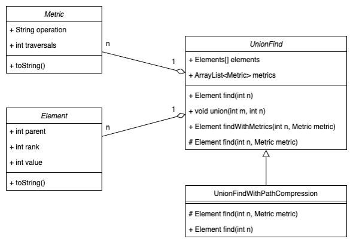
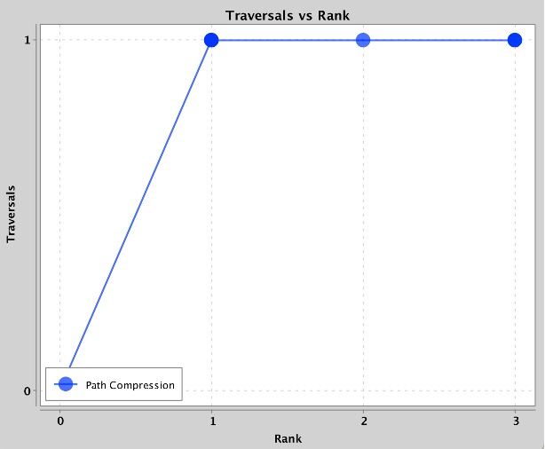
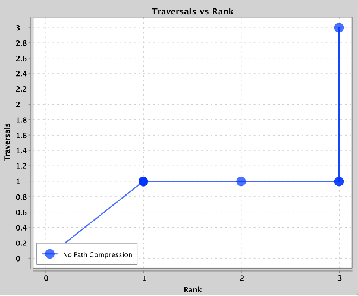
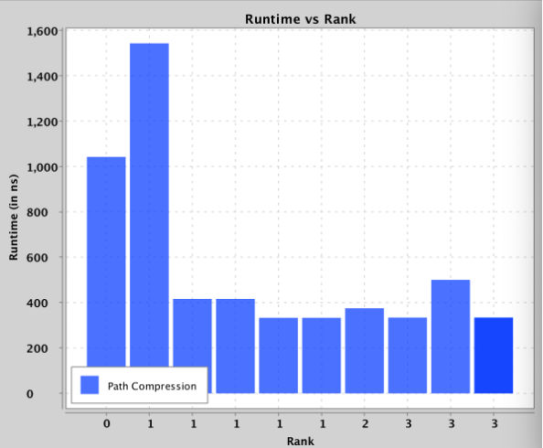
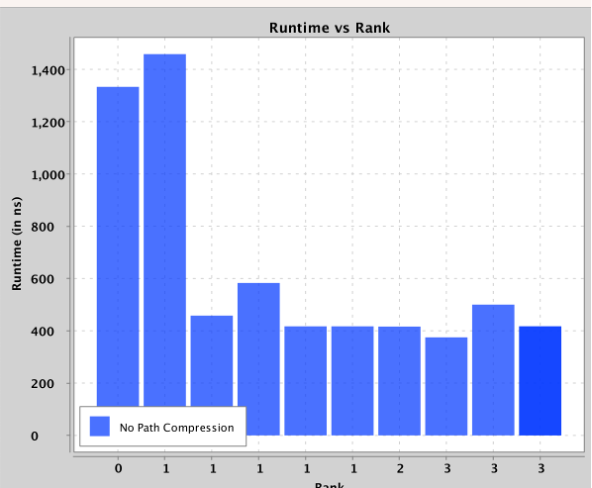
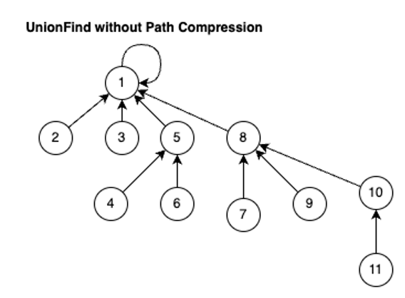
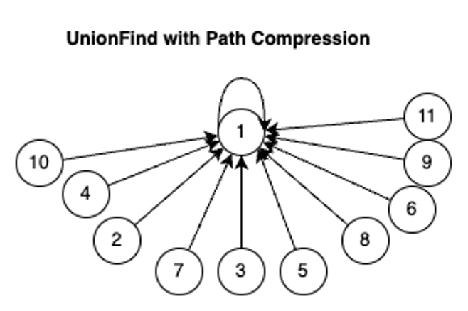

# CS 430 - Introduction to Algorithms - UnionFind/Disjoint Set Datastructure implementation
This project was built as part of university course CS 430 Introduction to Algorithms, inorder to demonstrate the UnionFind/Disjoint Set datastructure, with and without path compression and to testing on it and compare findings.
## Contents

1. [Introduction](#introduction)
2. [Implementation Details](#implementation-details)
3. [Class Diagram](#class-diagram)
4. [Sample Outputs](#sample-outputs)
5. [Analysis](#analysis)
6. [Conclusion](#conclusion)

## Introduction

The union-find data structure is a fundamental component in many algorithms, playing a crucial role in graph theory and clustering applications. Its significance is evident in algorithms such as Kruskal's minimum spanning tree, where it enables efficient identification of connected components. This assignment focuses on the implementation and evaluation of two variants of the union-find data structure: the basic union-find algorithm, which utilizes a rank-based approach for union operations, and the optimized union-find with path compression, which further enhances the find-set operation. This report presents a detailed illustration of the design and implementation of both algorithms, accompanied by an evaluation of their performance using test data and an assessment of their correctness. By comparing and contrasting these two variants, we can gain a deeper understanding of the trade-offs between them and their implications for real-world applications.

## Implementation Details

The datastructure is implemented in Java 20 SDK and built using the Intellij IDE, The charting library requires a minmum of Java 8+ for implementation.

Available Files:
1. Source Code (UnionFind/src/*)
2. test.txt
3. input.txt
4. test1.txt

Running Instructions:-

1.	open command prompt/terminal in the file location
2.	type java -jar ‘filename.jar’ ‘input_filename.txt’
      1.	here filename.jar and input_filename are placeholders for actual filenames,
      2.	Make sure to keep the input file in the same directory as the jar file.
      3.	Without any arguments it will search for default input file input.txt
      4.	Default file name for input_filename is input.txt: see example below:
3.	Output will be graph plots, terminal prints and ‘inputfilename_output.txt’ in the same directory.

Expected Outputs
*	The program will output the output of the find operations in the terminal as well as create an output file as required in the requirements.
*	The program will also generate 4 plots to compare the performance of the find operation among both the algorithms, one to compare the recursive ‘hops’ taken to reach the parent with respect to its rank, and the other time taken to perform the find operation, to Illustrate and observe and mark an inference from the two algorithms.

## Class Diagram

Class Diagram
## Sample Outputs

With Path Compression

No Path Compression

Path Compression

No Path Compression

## Analysis

The experimental results obtained from the Union-Find algorithms with and without path compression reveal several key insights into the performance of these algorithms.

UnionFind without Path Compression for text.txt

UnionFind with Path Compression for text.txt
### Traversal Analysis

The graphs illustrating the number of traversals versus rank demonstrate the significant impact of path compression on the find operation. By compressing the path, the number of traversals required to perform a find operation is reduced to a single traversal, in contrast to the find algorithm without path compression. This optimization yields a substantial improvement in time complexity, as the algorithm can quickly locate the root of the tree without traversing the entire path.
Interestingly, the analysis of the input.txt file reveals an unexpected phenomenon. Despite expectations, the number of traversals with respect to rank remains similar between the path compression algorithm and the algorithm without path compression. This contrasts with the results obtained from the test.txt file, which suggests that the difference between the algorithms becomes more apparent when the tree grows in height due to a larger number of nodes and higher rank unions. This inference is supported by the fact that input.txt has a relatively small number of nodes, which limits the tree's growth and masks the benefits of path compression.

### Runtime Analysis
The runtime plots for each of the different test inputs reveal a clear trend. The path compression algorithm consistently outperforms the algorithm without path compression, with the time efficiency improving significantly as the input size increases. Moreover, the time efficiency of the path compression algorithm approaches a constant value, whereas the time efficiency of the algorithm without path compression increases with the input size. This suggests that the path compression algorithm is more scalable and efficient in practice.
Theoretical Significance
The results of this experiment are consistent with the theoretical analysis of the Union-Find data structure. The use of path compression reduces the amortized time complexity of the find operation from O(log n) to O(α(n)) (equivalent to O(1)), making it more efficient in practice. This confirms that the optimization technique of path compression significantly reduces the time complexity of the find operation, making it more efficient in practice.

## Conclusion

In conclusion, this project has demonstrated the significant impact of path compression on the performance of the Union-Find algorithm. The experimental results show that path compression reduces the number of traversals required for the find operation, leading to a substantial improvement in time complexity. The analysis of the input files reveals that the benefits of path compression are more pronounced when the tree grows in height due to a larger number of nodes and higher rank unions.
The runtime plots further support the conclusion that path compression improves the time efficiency of the find operation, with the time complexity approaching a constant value. This is consistent with the theoretical analysis of the Union-Find data structure, which predicts an amortized time complexity of O(α(n)) (equivalent to O(1)) for the find operation with path compression, and O(log n) without path compression.
The results of this project have important implications for the design and implementation of efficient Union-Find algorithms in various applications. By incorporating path compression, developers can significantly improve the performance of their algorithms, leading to faster and more efficient processing of large datasets. Overall, this project has provided a comprehensive comparison of Union-Find algorithms with and without path compression, highlighting the benefits of this optimization technique in practice.